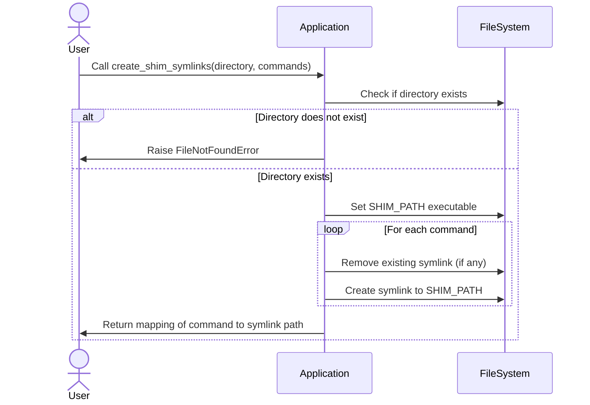
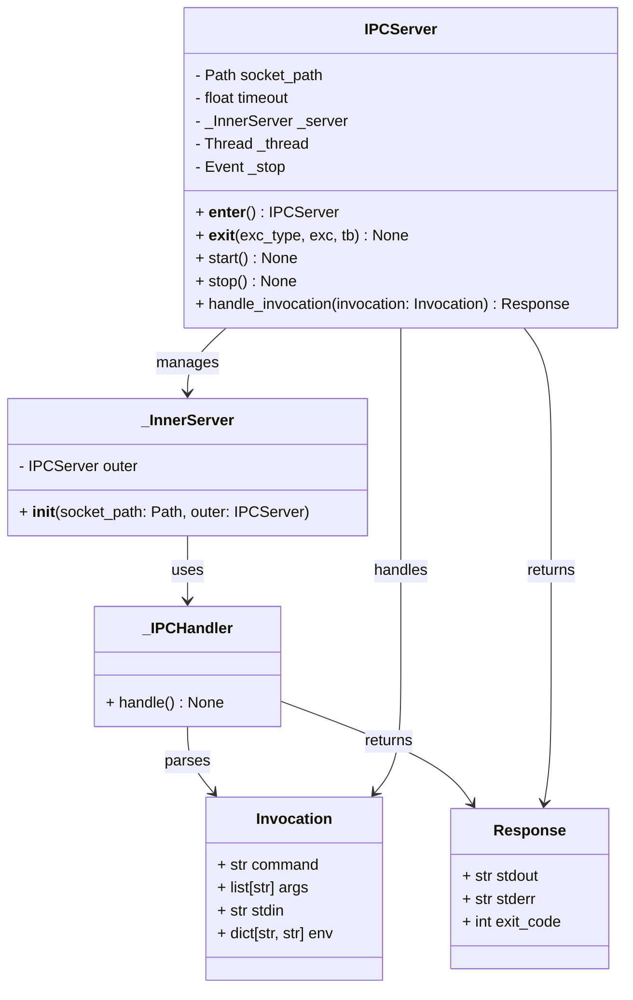
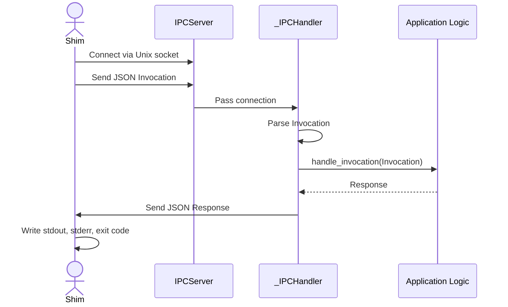
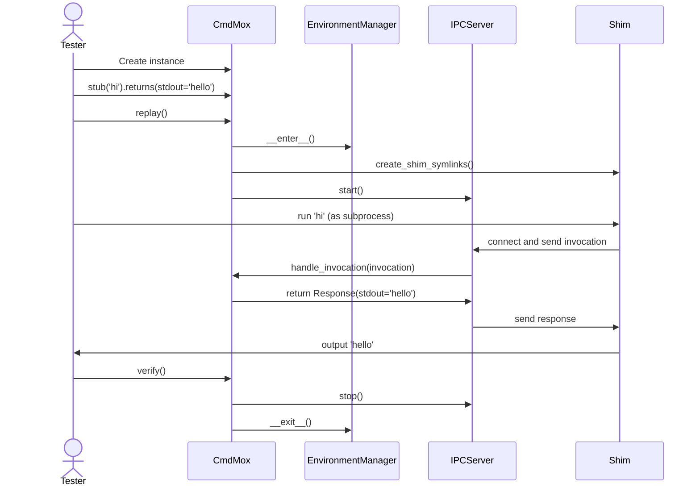
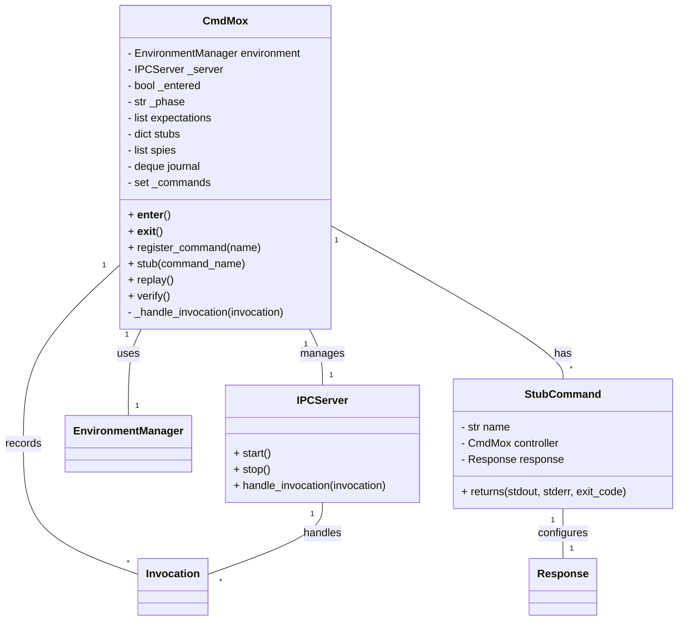
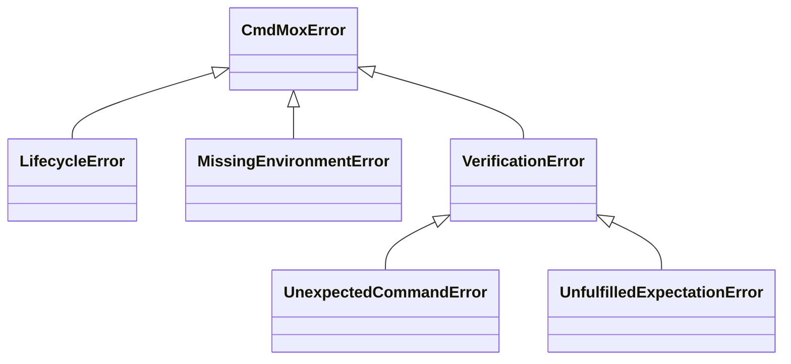

# `CmdMox`: A Technical Design Specification for Python-Native Command Mocking

## I. Conceptual Framework: Unifying PyMox and Shell Command Mocking

This document presents the technical design for `CmdMox`, a Python library for
stubbing, mocking, and spying on external commands in Unix-like environments.
The primary objective is to provide a robust, ergonomic, and Python-native
alternative to shell-based testing frameworks like BATS and `shellmock`. The
design prioritizes a fluent API modeled on the PyMox framework, combined with a
powerful and reliable command interception mechanism. This section establishes
the core principles and architectural philosophy that underpin the library's
design.

### 1.1 The "Record-Replay-Verify" Paradigm for External Processes

The foundational testing paradigm adopted by `CmdMox` is
"Record-Replay-Verify," a disciplined workflow popularized by the EasyMock
framework for Java and its Python counterpart, PyMox. This paradigm structures
tests into three distinct, sequential phases, enforcing clarity and
explicitness about a system's interactions with its dependencies.

1. **Record Phase:** In this initial phase, the developer uses the `CmdMox` API
   to declaratively define a set of expectations. An expectation is a precise
   description of a single external command invocation, including the command
   name, its arguments, expected standard input, and the behavior it should
   exhibit (e.g., its `stdout`, `stderr`, and exit code). This is the setup
   portion of the test, where the "script" for the test doubles is written.

2. **Replay Phase:** Once all expectations are recorded, the test transitions
   the framework into the replay phase. During this phase, the system or
   component under test is executed. Any attempt to invoke an external command
   is intercepted by `CmdMox`. The framework consults the recorded expectations
   to find one that matches the actual invocation. If a match is found,
   `CmdMox` provides the specified behavior. If no match is found, it is
   treated as an unexpected interaction, which will cause the test to fail
   during the final phase.

3. **Verify Phase:** After the code under test has completed its execution, the
   test enters the final verification phase. In this phase, `CmdMox` checks
   whether the actual invocations that occurred during the replay phase
   perfectly match the expectations set during the record phase. The test
   succeeds only if every recorded expectation was met exactly as specified
   (including call counts and ordering) and no unexpected command calls
   occurred. Any deviation results in a `VerificationError` with a detailed
   report of the discrepancy.

Adopting this strict paradigm for command-line testing offers significant
advantages. It forces developers to be deliberate about the external process
dependencies of their applications. Unlike more lenient mocking styles, it
prevents "dependency creep" by immediately failing a test if an unexpected
command is called. The resulting tests are highly self-documenting; the record
phase serves as a clear specification of the application's external
interactions.

<!-- markdownlint-disable MD013 -->

### 1.2 The Core Architectural Principle: Command Interception via Dynamic `PATH` Manipulation

<!-- markdownlint-enable MD013 -->

The fundamental mechanism for intercepting command invocations will be the
dynamic manipulation of the `PATH` environment variable. This is a well-
established and reliable technique employed by a wide array of shell-based
mocking tools to redirect command calls.

The process works as follows:

- At the beginning of a test run, `CmdMox` creates a temporary, securely-named
  directory (e.g., within `/tmp`).

- For each command that needs to be mocked (e.g., `git`, `ls`, `curl`), the
  library creates a corresponding executable file, or "shim," inside this
  temporary directory.

- The absolute path of this temporary directory is then prepended to the `PATH`
  environment variable of the test process.

- When the code under test attempts to execute a command like `git`, the
  operating system's standard library functions for finding executables (such
  as `execvp`) search the directories listed in `PATH` in order. The OS will
  find the `CmdMox`-generated shim in the temporary directory before it finds
  the real system command in a standard location like `/usr/bin/git`.

- This shim then becomes the entry point for the mocked behavior.

- Upon test completion (or failure), the `PATH` variable is restored to its
  original state, and the temporary directory and all its shims are removed,
  ensuring no side effects linger beyond the test's execution.

While the `PATH` hijacking technique is common, `CmdMox` introduces a critical
architectural improvement over existing tools. Frameworks like `shellmock` and
`bats-mock` generate *shell scripts* to act as shims. These shell shims are
inherently limited. To communicate invocation details back to the main test
runner process, they must resort to writing to temporary log files (e.g.,
`shellmock.out`, `*.playback.capture.tmp`). The test runner then has the
brittle and inefficient task of parsing these flat text files to verify the
interactions. This approach struggles with structured data, concurrency, and
complex quoting or argument-passing scenarios.

`CmdMox` will instead generate lightweight *Python scripts* as its shims. This
design choice unlocks a far more powerful and robust implementation. A Python
shim can leverage the full breadth of Python's standard library for
sophisticated Inter-Process Communication (IPC). Instead of writing to fragile
log files, the shim can communicate with the main `CmdMox` test process over a
dedicated, high-performance channel like a Unix domain socket. This allows for
the bidirectional transfer of rich, structured data (e.g., JSON-serialized
objects representing the command, its arguments, environment, and `stdin`
content). This architectural decision elevates `CmdMox` beyond the capabilities
of its shell-based predecessors, enabling more complex features, better
performance, and greater reliability, as detailed in Section III.

### 1.3 Defining the Terminology: Stubs, Mocks, and Spies

To ensure clarity, `CmdMox` will adopt precise definitions for its test
doubles, based on established software testing theory and adapted for the
context of external commands.

- **Stub:** A stub is a simple, "fire-and-forget" replacement for a command. Its
  purpose is to provide a fixed, canned response to a command invocation to
  allow the code under test to proceed. For example, a test might stub the
  `git` command to always return a successful exit code. A stub does not
  perform any verification; if the stubbed command is never called, the test
  still passes. Stubs are used to satisfy a dependency, not to test an
  interaction.

- **Mock:** A mock is a "verifiable" replacement for a command. Like a stub, it
  provides a defined behavior. However, a mock also carries a set of strict
  expectations about how it must be invoked. These expectations can include the
  exact arguments, the number of times it should be called, and the order of
  invocation relative to other mocks. The `verify()` phase of the test will
  fail if these expectations are not met precisely. Mocks are used to test that
  the system under test interacts with its dependencies *in a specific, correct
  way*. This aligns with the strict philosophy of PyMox.

- **Spy:** A spy is an "observational" test double. A spy wraps a command to
  record all invocations made to it, including arguments, `stdin`, and
  environment variables. A spy can either be configured with a stubbed behavior
  or it can "passthrough" and execute the real underlying command. After the
  test run, the developer can inspect the spy's recorded history to make
  assertions about how the command was used. This provides a more flexible,
  `assert`-based verification style, similar to the functionality found in
  tools like `bash_placebo`, and is useful when the exact sequence or number of
  calls is not known beforehand or is not the primary subject of the test.

## II. The Public API: A `CmdMox` User's Guide

The design of the `CmdMox` public API is paramount, with a primary goal of
providing an ergonomic, intuitive, and "Pythonic" user experience. The API is
heavily inspired by the fluent, chainable Domain-Specific Language (DSL) of the
modern PyMox fork, particularly its "New Elegant Way" of integration with
testing frameworks. This section serves as the definitive contract for how a
developer will interact with the library.

### 2.1 The `CmdMox` Controller: The Central Orchestrator

The central class and primary user entry point for the library will be
`cmd_mox.CmdMox`. An instance of this class encapsulates the entire state for a
single test case, including all recorded expectations, the invocation journal,
lifecycle and environment management context. It is analogous to the `mox.Mox`
class in PyMox and is responsible for orchestrating the record-replay-verify
lifecycle.

### 2.2 Ergonomic Integrations: `pytest` Fixtures and Context Managers

To minimize boilerplate and promote best practices, the library will offer
seamless integration with modern Python testing workflows.

**Primary Interface:** `pytest` **Fixture**

The recommended and primary method for using `CmdMox` will be through a
`pytest` fixture. This aligns with the "New Elegant Way" promoted by PyMox and
the broader Python testing ecosystem. Users will enable the plugin, and a
`cmd_mox` fixture will be automatically available to their test functions. This
fixture provides a fresh, properly configured `cmd_mox.CmdMox` instance for
each test, with setup and teardown handled automatically.

*Example Usage:*

```python
# In conftest.py
pytest_plugins = ("cmd_mox.pytest_plugin",)

# In test_my_cli_tool.py
def test_git_clone_functionality(cmd_mox):
    # The 'cmd_mox' fixture is a ready-to-use cmd_mox.CmdMox instance.
    # Record phase:
    cmd_mox.mock('git').with_args('clone', 'https://a.b/c.git').returns(exit_code=0)

    # Replay phase:
    cmd_mox.replay()
    result = my_cli_tool.clone_repo('https://a.b/c.git')

    # Assertions on the code under test:
    assert result is True

    # Verify phase:
    cmd_mox.verify()
```

#### Alternative Interface: Context Manager

For use cases outside of `pytest` or when more explicit control is desired, a
standard Python context manager will be provided. The context manager ensures
that the environment is correctly set up on entry and, critically, that it is
torn down and restored on exit, even in the case of an exception.

*Example Usage:*

```python
import cmd_mox
import subprocess

with cmd_mox.CmdMox() as mox:
    mox.stub('ls').with_args('-l').returns(stdout='total 0')
    mox.replay()

    # The PATH is now modified within this block.
    output = subprocess.check_output(['ls', '-l'], text=True)
    assert output == 'total 0'

mox.verify()
# The PATH is automatically restored here.
```

### 2.3 Creating Test Doubles: `mox.mock()`, `mox.stub()`, and `mox.spy()`

The `CmdMox` controller instance provides three distinct factory methods for
creating the different types of test doubles, each returning a chainable object
for further configuration.

- `mox.mock(command_name: str) -> MockCommand`: Creates a strict `MockCommand`
  object. This is used for interactions that must be verified. The returned
  object is used to build up a complete expectation using the fluent API.

- `mox.stub(command_name: str) -> StubCommand`: Creates a `StubCommand` object.
  This is used to provide canned responses for dependencies that are not the
  focus of the test.

- `mox.spy(command_name: str) -> SpyCommand`: Creates a `SpyCommand` object.
  This is used to record invocations for later inspection without the strict
  upfront expectations of a mock.

Early iterations of the library exposed distinct ``StubCommand``,
``MockCommand`` and ``SpyCommand`` classes. These have since been unified into
a single ``CommandDouble`` implementation tagged with a ``kind`` attribute. The
factories ``mox.stub()``, ``mox.mock()`` and ``mox.spy()`` still exist for
ergonomics but internally return ``CommandDouble`` instances. Each double
tracks invocations so verification can assert on call counts and order.

The ``kind`` flag determines whether a double is considered an expectation
(stubs and mocks) or merely observational (spies). It also governs how
``CmdMox.verify()`` checks the journal for unexpected or missing commands.

### 2.4 The Fluent API for Defining Expectations

The core of the library's ergonomic design lies in its fluent, chainable API
for defining the behavior and expectations of test doubles. This DSL allows
developers to write clear, readable, and expressive test setups, drawing direct
inspiration from PyMox's method-chaining style.

- `.with_args(*args: str)`**:** Specifies the exact, ordered list of
  command-line arguments that are expected. The match must be precise.

- `.with_matching_args(*comparators)`**:** For more flexible matching, this
  method accepts a sequence of `CmdMox` comparator objects (see Section V).
  This allows for matching based on type, regular expressions, or custom logic.

- `.with_stdin(data: Union[str, bytes, Comparator])`**:** Defines an expectation
  for the data that is piped to the command's standard input. This can be a
  literal string or bytes, or a comparator for flexible matching.

<!-- markdownlint-disable MD013 -->

- `.returns(stdout: Union[str, bytes] = b'', stderr: Union[str, bytes] = b'',
  exit_code: int = 0)`**:**

<!-- markdownlint-enable MD013 -->

Specifies the static result of the command invocation. The mock will write the
given `stdout` and `stderr` to the corresponding streams and exit with the
provided `exit_code`.

- `.runs(handler: Callable)`**:** Provides a powerful mechanism for dynamic
  behavior. The `handler` is a Python callable that will be executed by the
  `CmdMox` framework when the mock is invoked. The callable receives a
  structured `Invocation` object containing details of the call (args, `stdin`,
  env) and must return a tuple of `(stdout_bytes, stderr_bytes, exit_code)`.
  This is a significant enhancement of PyMox's callback feature, enabling
  stateful mocks and complex conditional logic.

- `.times(count: int)`**:** Specifies the exact number of times this specific
  expectation is expected to be met. This is inspired by PyMox's
  `MultipleTimes()` modifier.

- `.in_order()`**:** Marks this expectation as part of a default, strictly
  ordered group. Invocations must occur in the order they were recorded. An
  `.any_order()` modifier can be provided for expectations where the calling
  order is not significant, mirroring PyMox's behavior.

To ensure `CmdMox` is a compelling replacement for `shellmock`, the following
table maps the core features of `shellmock` to their more expressive `CmdMox`
API equivalents, demonstrating complete functional parity.

**Table 1:** `shellmock` **to** `CmdMox` **Feature Mapping** <!-- markdownlint-
disable MD013 -->

| shellmock Feature (from)                    | Proposed CmdMox API Equivalent                     |
| ------------------------------------------- | -------------------------------------------------- |
| Mock an executable cmd                      | mock_cmd = mox.mock('cmd')                         |
| Define behavior for specific args (--match) | mock_cmd.with_args('arg1', 'arg2')                 |
| Define exit code (--status \<exit_code>)    | mock_cmd.returns(exit_code=\<exit_code>)           |
| Define stdout (--output \<string>)          | mock_cmd.returns(stdout=\<string>)                 |
| Partial argument matching (--type partial)  | mock_cmd.with_matching_args(Contains('arg'))       |
| Regex argument matching (--type regex)      | mock_cmd.with_matching_args(Regex(r'--file=\\S+')) |
| Match on stdin (--match-stdin)              | mock_cmd.with_stdin('some input')                  |
| Custom behavior (--exec \<command>)         | mock_cmd.runs(lambda inv: ('output', b'', 0))      |
| Verify calls (shellmock_verify)             | mox.verify()                                       |
<!-- markdownlint-enable MD013 -->

### 2.5 The Lifecycle in Practice: `replay()` and `verify()`

The `CmdMox` controller provides two methods that demarcate the phases of the
testing lifecycle.

- `mox.replay()`: This method must be called after all expectations have been
  recorded. It signals the end of the record phase and the beginning of the
  replay phase. Internally, this call triggers the creation of the temporary
  shim directory, the generation of the shim executables, and the modification
  of the `PATH` environment variable. It effectively "arms" the mocking
  framework.

- `mox.verify()`: This method must be called after the code under test has been
  executed. It signals the end of the replay phase. It performs the critical
  verification logic, comparing the journal of actual invocations against the
  list of recorded expectations. If any discrepancy is found—such as an
  unexpected call, an unfulfilled expectation, or an incorrect argument—it
  raises a detailed `VerificationError`. The error messages will be designed
  for maximum debuggability, providing a clear "diff" between the expected and
  actual interactions, similar to the highly-regarded error reporting of PyMox.
  Finally, it orchestrates the cleanup of all test artifacts, including
  restoring the `PATH`.

## III. Architectural Blueprint: Inside `CmdMox`

This section details the internal architecture of `CmdMox`, providing a
blueprint for implementation. The design focuses on robustness, process safety,
and performance, leveraging Python's strengths to overcome the limitations of
existing shell-based tools.

### 3.1 The Shim Generation Engine

This component is responsible for the on-the-fly creation of the executable
Python shims that intercept command calls. To maximize efficiency and minimize
disk I/O, the engine will not write a unique script for every mocked command.

Instead, the `CmdMox` library will contain a single, generic `shim.py` template
script. When `mox.replay()` is invoked, the `CmdMox` controller will execute
the following steps:

1. Create a temporary directory with a unique, process-safe name (e.g.,
   `/tmp/cmdmox-pytest-worker-1-pid-12345`).

2. For each unique command name being mocked (e.g., `git`, `curl`), it will
   create a symbolic link inside the temporary directory (e.g., `git` ->
   `.../ cmdmox/internal/shim.py`). This avoids duplicating the script's
   content on disk.

3. The master `shim.py` script itself will be made executable (`chmod +x`). The
   operating system will follow the symlink and execute the target script.

4. The shim script will determine which command it is impersonating by
   inspecting its own invocation name (`sys.argv`).

This symlink-based approach is highly efficient and ensures that any updates or
bug fixes to the shim logic only need to be applied to one central template
file.



### 3.2 State Management and Inter-Process Communication (IPC)

The communication between the main test process (hosting the `CmdMox`
controller) and the numerous, short-lived shim processes is the most critical
architectural element of `CmdMox`. The design moves away from the fragile,
file- based communication methods used by shell-based tools in favor of a
modern, robust IPC bus.

This IPC bus will be implemented using a Unix domain socket, which provides a
fast and reliable stream-based communication channel between processes on the
same host. The workflow is as follows:

1. **Server Initialization:** When the `CmdMox` controller enters the replay
   phase, it starts a lightweight server thread. This thread creates a
   `socket.socket` listening on a unique path within the temporary shim
   directory (e.g., `/tmp/ cmd_mox.../ipc.sock`).

2. **Environment Setup:** The controller exports the path to this socket in an
   environment variable (e.g., `CMOX_IPC_SOCKET`). This variable is inherited
   by any child processes, including the code under test and, consequently, the
   shims it invokes.

3. **Shim Connection:** When a shim is executed by the OS, its first action is
   to read the `CMOX_IPC_SOCKET` environment variable and connect to the
   listening server thread in the main test process.

4. **Invocation Reporting:** The shim gathers all relevant invocation data: the
   command name, the list of arguments (`sys.argv[1:]`), the complete content
   of its standard input, and a snapshot of its current environment variables.
   It serializes this data into a structured format like JSON and sends it over
   the socket to the server.

5. **Server-Side Processing:** The server thread in the main process receives
   the JSON payload. It deserializes it into an `Invocation` object and records
   it in the in-memory Invocation Journal. It then searches its list of
   `Expectation` objects to find a match for this invocation.

6. **Response Delivery:** Once a matching expectation is found, the server
   determines the prescribed response. If it's a static `.returns()` value, it
   serializes this data and sends it back to the shim. If it's a dynamic
   `.runs(handler)`, the server thread executes the handler function (which is
   in the same process and has access to all test state) and sends its result
   back.

7. **Shim Action:** The shim receives the response payload from the server. It
   writes the `stdout` and `stderr` data to its own standard streams and then
   terminates with the specified `exit_code`.

This socket-based IPC architecture is the key technical differentiator for
`CmdMox`. It is transactional, inherently process-safe, and allows for the
exchange of rich, complex data structures, providing a foundation for advanced
features that are infeasible with file-based logging.

The initial implementation ships with a lightweight `IPCServer` class. It uses
Python's `socketserver.ThreadingUnixStreamServer` to listen on a Unix domain
socket path provided by the `EnvironmentManager`. Incoming JSON messages are
parsed into `Invocation` objects and processed in background threads with
reasonable timeouts. Responses are JSON encoded `stdout`, `stderr`, and
`exit_code` data. The server cleans up the socket on shutdown to prevent stale
sockets from interfering with subsequent tests. The communication timeout is
configurable via the `CMOX_IPC_TIMEOUT` environment variable.

To avoid races and corrupted state, `IPCServer.start()` first checks if an
existing socket is in use before unlinking it. After launching the background
thread, the server polls for the socket path using an exponential backoff to
ensure it appears before clients connect. On the client side, `invoke_server()`
retries connection attempts a few times and validates that the server's reply
is valid JSON, raising a `RuntimeError` if decoding fails. These safeguards
make the IPC bus robust on slower or heavily loaded systems.





### 3.3 The Environment Manager

This component will be implemented as a robust, exception-safe context manager
that handles all modifications to the process environment.

- On `__enter__`:

  1. It will save a copy of the original `os.environ`.

  1. It will create the temporary shim directory.

  1. It will prepend the shim directory's path to `os.environ`.

  1. It will set any other necessary environment variables for the IPC
     mechanism, such as `CMOX_IPC_SOCKET`. Clients may additionally honour
     `CMOX_IPC_TIMEOUT` to override the default connection timeout.

- On `__exit__`:

  1. It will execute in a `finally` block to guarantee cleanup, even if the test
     fails with an exception.

  1. It will restore the original `PATH` and unset any `CmdMox`-specific
     environment variables.

  1. It will perform a recursive deletion of the temporary shim directory and
     all its contents (symlinks and the IPC socket).

The manager is not reentrant. Nested usage would overwrite the saved
environment snapshot, so attempts to use it recursively will raise
`RuntimeError`. Instead of clearing `os.environ` on exit, the manager restores
only those variables that changed and removes any that were added. This
approach avoids disrupting other threads that might rely on the environment
remaining mostly stable.

This rigorous management ensures that each test runs in a perfectly isolated
environment and leaves no artifacts behind, a critical requirement for a
reliable testing framework.

### 3.4 The Invocation Journal

The Invocation Journal is a simple but crucial in-memory data structure within
each `CmdMox` controller instance. It will likely be implemented as a
`collections.deque` or a standard `list`. Its sole purpose is to store a
chronological record of all command calls that occurred during the replay phase.

Each time the IPC server thread receives an invocation report from a shim, it
constructs a structured `Invocation` object (e.g., a dataclass or `NamedTuple`)
containing the command name, arguments, `stdin`, and environment. This object
is then appended to the journal. The `verify()` method uses this journal as the
definitive record of what actually happened, comparing it against the
predefined expectations to detect any discrepancies.

## IV. Feature Deep Dive: Stubbing

This section details the implementation of the simplest form of test double:
the stub. Stubs are essential for satisfying dependencies of the system under
test without coupling the test to the implementation details of those
dependencies.

### 4.1 Simple, "Fire-and-Forget" Replacements

The primary use case for a stub is to provide a fixed, predictable response. An
API call like `mox.stub('grep').returns(stdout='match', exit_code=0)` initiates
the following process:

1. **Configuration:** The call creates a `Stub` configuration object within the
   `CmdMox` controller. This object stores the command name (`grep`) and the
   associated response data (stdout, stderr, exit code).

2. **Replay Phase:** During `mox.replay()`, this configuration is made available
   to the IPC server thread. It might be stored in a simple dictionary mapping
   command names to stub configurations.

3. **Invocation:** When the code under test executes `grep`, the `grep` shim is
   invoked. The shim connects to the IPC server and reports its invocation.

4. **Response:** The IPC server looks up `grep` in its stub configurations. It
   finds the defined behavior and sends a JSON response like
   `{'stdout': 'match', 'stderr': '', 'exit_code': 0}` back to the shim.

5. **Execution:** The shim receives this payload, prints "match" to its
   `stdout`, and exits with status 0.

6. **Verification:** During `mox.verify()`, stubs are not checked. If the `grep`
   command is never called, the test still passes. This "fire-and-forget"
   nature is the defining characteristic of a stub.

### 4.2 Advanced Stubs: Callable Handlers

To support dynamic or stateful behavior, `CmdMox` allows stubs to be configured
with a callable handler via the `.runs()` method, for example:
`mox.stub('date').runs(my_date_handler)`.

The implementation of this feature leverages the IPC architecture:

1. The `my_date_handler` callable itself is a Python object that exists only in
   the main test process. It is *not* serialized or sent to the shim process.

2. When the `date` shim is invoked and reports its call to the IPC server, the
   server identifies that the corresponding stub is configured with a `.runs()`
   handler.

3. The IPC server thread—which runs within the main test process and therefore
   has direct access to `my_date_handler`—executes the handler. It passes the
   structured `Invocation` object as an argument to the handler.

4. The handler performs its logic (which can involve accessing or modifying
   state within the test function's scope) and returns a result tuple:
   `(stdout_bytes, stderr_bytes, exit_code)`.

5. The IPC server serializes this dynamic result and sends it back to the `date`
   shim, which then acts accordingly.

This powerful feature enables the creation of sophisticated stubs that can, for
instance, return different values on subsequent calls, simulate I/O operations,
or interact with other components of the test setup, far exceeding the
capabilities of static mocks defined in shell scripts.

## V. Feature Deep Dive: Mocking

This section details the implementation of the library's core feature: strict,
verifiable mocking. Mocks are the foundation of the "Record-Replay-Verify"
paradigm and are used to assert that the system under test interacts with its
external dependencies in a precisely defined manner.

### 5.1 The Argument Matching Engine and Comparators

To provide flexibility beyond exact argument matching, `CmdMox` will include a
rich set of comparator objects, directly inspired by the comparators in PyMox.
These objects allow for defining expectations based on patterns and properties
rather than just literal values.

The library will provide a suite of built-in comparators:

- `cmd_mox.Any()`: Matches any single argument at a given position.

- `cmd_mox.IsA(type)`: Matches any argument that is an instance of the given
  Python type (after basic parsing).

- `cmd_mox.Regex(pattern: str)`: Matches any argument that conforms to the given
  regular expression.

- `cmd_mox.Contains(substring: str)`: Matches any argument that contains the
  given substring.

- `cmd_mox.StartsWith(prefix: str)`: Matches any argument that starts with the
  given prefix.

- `cmd_mox.Predicate(callable)`: The most flexible comparator. It accepts a
  callable that takes the argument as input and returns `True` for a match and
  `False` otherwise.

When a developer defines an expectation using
`with_matching_args(IsA(str), Regex(r'--file=\S+'))`, these comparator objects
are stored as part of the `Expectation` configuration. During the replay phase,
when the IPC server receives an invocation from a shim, it iterates through its
list of recorded expectations. For each expectation, it compares the incoming
arguments against the stored comparators to determine if there is a match. This
engine is the key to writing flexible yet precise tests.

### 5.2 Verification Logic: The Heart of `mox.verify()`

The `mox.verify()` method encapsulates the most complex logic in the library.
Its purpose is to algorithmically reconcile the list of predefined
`Expectation` objects with the chronological `InvocationJournal` collected
during the replay phase. A mismatch of any kind constitutes a test failure.

The verification algorithm will perform several critical checks:

1. **Unexpected Invocations:** It iterates through the `InvocationJournal`. For
   each actual invocation, it checks if it matches any of the recorded
   expectations. If an invocation occurs that does not match *any* unfulfilled
   expectation, it signifies an unexpected command call. This immediately
   raises an `UnexpectedCommandError`, analogous to PyMox's
   `UnexpectedMethodCallError`. The error message will clearly state the
   unexpected command that was called.

2. **Unfulfilled Expectations:** After checking all actual invocations, the
   algorithm checks if any `Expectation` objects remain unfulfilled. If an
   expectation was recorded but never matched by an actual invocation, it
   raises an `UnfulfilledExpectationError`. This is equivalent to PyMox's
   "Expected methods never called" error and is critical for ensuring that the
   code under test is actually exercising its dependencies as intended.

3. **Incorrect Call Counts:** For expectations defined with `.times(N)`, the
   verifier ensures that the expectation was met exactly `N` times. If it was
   met more or fewer times, a `VerificationError` is raised.

4. **Order Violations:** For expectations marked with `.in_order()`, the
   verifier ensures that they were met in the same sequence in which they were
   recorded. It maintains a pointer to the "current" expected ordered call and
   advances it only when a match is found. An out-of-order call is treated as
   an unexpected invocation.

The error messages generated by `verify()` are a key part of the user
experience. They will be meticulously crafted to provide maximum diagnostic
information, showing the expected call (including arguments and comparators)
and contrasting it with the actual call that was received, or noting its
absence entirely.

## VI. Feature Deep Dive: Spying

Spying provides a more flexible, observational approach to testing
interactions, complementing the strictness of mocks. Spies are useful for when
the exact details of an interaction are not critical to the test's success, but
the developer still wants to assert that a call was made.

### 6.1 The Spy API and Invocation History

Creating a spy is straightforward: `spy = mox.spy('curl')`. This registers
`curl` as a spied command. By default, a spy will act like a stub that does
nothing and returns a successful exit code. Its primary purpose is to record
calls.

After `mox.verify()` has been called (which for spies simply confirms no
unexpected errors occurred and performs cleanup), the test can inspect the spy
object to access its recorded history. The spy object will expose a public API
for this purpose:

- `spy.call_count`: An integer representing the total number of times the
  command was called.

- `spy.invocations`: A list of `Invocation` objects, where each object provides
  structured access to a single call's details.

*Example Assertion-Style Verification:*

```python
def test_downloader_uses_correct_user_agent(mox):
    spy = mox.spy('curl')
    spy.returns(stdout='Success') # Spies can also be given behavior
    mox.replay()

    download_file('http://example.com/file.zip')

    mox.verify()

    assert spy.call_count == 1
    invocation = spy.invocations
    assert invocation.args == ['curl', 'http://example.com/file.zip']
    assert 'User-Agent: MyDownloader/1.0' in invocation.env
```

This style of verification is less rigid than mocking and is preferred when the
goal is simply to check that "a call happened with these properties" rather
than enforcing a strict sequence of interactions.

### 6.2 Passthrough Spies: The "Record Mode"

A powerful extension of the spy concept is the "passthrough" spy. This feature
enables a "record and replay" workflow for test generation, an incredibly
useful tool for bootstrapping tests for legacy systems or complex command-line
interactions, similar in spirit to the record mode of `bash_placebo`.

A passthrough spy is created with `spy = mox.spy('aws').passthrough()`. The
implementation leverages the IPC architecture in a unique way:

1. When the `aws` shim is invoked, it reports the call to the IPC server as
   usual.

2. The IPC server identifies the spy is in passthrough mode. Instead of
   returning a canned response, it instructs the shim to execute the *real*
   command. To do this, the server provides the shim with the path to the real
   executable, which it finds by searching the original `PATH` (which was saved
   by the Environment Manager).

3. The shim process uses `subprocess.run` or a similar mechanism to execute the
   real `aws` command with the original arguments and `stdin`. It captures the
   real command's `stdout`, `stderr`, and `exit_code`.

4. The shim then sends a second message to the IPC server containing this
   captured output.

5. The server combines the initial invocation data (what went in) with the
   captured results (what came out) into a complete `Invocation` object and
   stores it in the spy's history. It also sends the captured results back to
   the shim, which then reproduces them as its own output.

The immediate benefit is that a test can run against a real system while
`CmdMox` transparently records every interaction. The long-term implication is
the potential for a powerful test generation utility. A developer could run a
complex script under a `CmdMox` recorder, which would use passthrough spies to
capture all external command interactions. The recorder could then
automatically generate a complete, self-contained `pytest` file, with all the
real interactions converted into `mox.mock(...).returns(...)` definitions. This
would dramatically lower the barrier to entry for placing legacy command-line
tools under test.

## VII. Advanced Topics and Implementation Considerations

This section addresses known complexities, edge cases, and non-functional
requirements that the implementation must handle to be considered a robust and
professional-grade library.

### 7.1 Handling Complex Shell Interactions: Pipelines and Redirection

A critical aspect to define is the library's scope regarding shell syntax.
`PATH` hijacking, as a mechanism, intercepts the execution of individual
commands. It does not, and cannot, intercept or interpret the functionality of
the shell itself, such as pipelines (`|`), I/O redirection (`>`, `<`), or
process substitution (`<()`).

Therefore, the design explicitly states that `CmdMox` mocks the *tools*, not
the *shell* that glues them together. When a user needs to test a script that
contains a command like `grep foo file.txt | sort -r`, the test is not on the
pipeline itself, but on the behavior of `grep` and `sort`.

The user would test this by executing the full command line (e.g., via
`subprocess.run(..., shell=True)`) and setting up mocks for each individual
command in the pipeline:

*Example Pipeline Test:*

```python
def test_pipeline_logic(mox):
    # Mock the first command in the pipe
    mox.mock('grep').with_args('foo', 'file.txt').returns(stdout='c\na\nb\n')

    # Mock the second command, expecting the output of the first as its input
    mox.mock('sort').with_args('-r').with_stdin('c\na\nb\n').returns(stdout='c\nb\na\n')

    mox.replay()

    # Run the actual shell command
    result = subprocess.check_output('grep foo file.txt | sort -r', shell=True, text=True)

    assert result == 'c\nb\na\n'
    mox.verify()
```

This approach correctly tests that the application invokes the constituent
commands as expected. This limitation and the proper testing pattern must be
clearly documented for users.

### 7.2 Managing the Mocked Environment

Applications often depend on environment variables. `CmdMox` must provide a way
to control the environment in which the mocked commands execute. The fluent API
will include a `.with_env(vars: dict)` method on `MockCommand`, `StubCommand`,
and `SpyCommand` objects.

When this method is used, the provided dictionary of environment variables is
stored with the expectation. This data is then passed to the shim as part of
the response payload from the IPC server. Before executing its primary action
(e.g., printing `stdout` or running a handler), the shim script will update its
own environment using `os.environ.update(vars)`. This ensures that any further
processes spawned by a `.runs()` handler, for example, will inherit the
correct, mock-specific environment.

### 7.3 Concurrency and Parallelization (`pytest-xdist`)

Modern test suites are frequently run in parallel using tools like
`pytest- xdist` to reduce execution time. `CmdMox` must be designed from the
ground up to be fully compatible with parallel execution, where each test
worker runs in a separate process.

The proposed IPC-based architecture is inherently conducive to safe
parallelization. The file-based communication used by shell-based mockers would
require complex file locking or intricate namespacing schemes to avoid race
conditions between parallel workers. `CmdMox` avoids this entirely.

The `pytest` fixture will be designed to be "xdist-aware." It can access the
worker ID provided by `pytest-xdist` (e.g., `gw0`, `gw1`). This ID will be
incorporated into the names of the temporary directory and the IPC socket:

- Worker 0 Directory: `/tmp/cmdmox-gw0-pid12345/`

- Worker 0 Socket: `/tmp/cmdmox-gw0-pid12345/ipc.sock`

- Worker 1 Directory: `/tmp/cmdmox-gw1-pid54321/`

- Worker 1 Socket: `/tmp/cmdmox-gw1-pid54321/ipc.sock`

Because each worker process gets its own `CmdMox` instance, its own unique shim
directory, and its own private IPC socket, there is no shared state between
workers. Each test runs in a completely isolated `CmdMox` environment,
eliminating the possibility of cross-test interference and ensuring correctness
and reliability in parallel test runs.

<!-- markdownlint-disable MD013 -->

#### Table 2: Fluent API Method Reference

This table provides a quick, scannable reference for the core Domain-Specific
Language (DSL) used to build expectations.

| Method                              | Purpose                                                           | Example                                             |
| ----------------------------------- | ----------------------------------------------------------------- | --------------------------------------------------- |
| .with_args(\*args)                  | Specifies the exact arguments the command must be called with.    | .with_args('ls', '-l', '/tmp')                      |
| .with_matching_args(\*matchers)     | Specifies flexible argument matchers (e.g., comparators).         | .with_matching_args(IsA(str), Regex(r'--foo=\\d+')) |
| .with_stdin(data)                   | Specifies expected stdin content. Can use strings or comparators. | .with_stdin(Contains('payload'))                    |
| .with_env(vars)                     | Specifies environment variables for the command's context.        | .with_env({'API_KEY': 'secret'})                    |
| .returns(stdout, stderr, exit_code) | Defines the static output and exit code of the mocked command.    | .returns(stdout=b'OK', exit_code=0)                 |
| .runs(handler)                      | Provides a callable for dynamic, stateful behavior.               | .runs(my_handler_func)                              |
| .times(count)                       | Sets the expected number of times the command will be called.     | .times(2)                                           |
| .in_order()                         | Marks this expectation as part of an ordered sequence.            | .in_order()                                         |
| .passthrough()                      | (Spy only) Executes the real command and records the interaction. | mox.spy('ssh').passthrough()                        |

<!-- markdownlint-enable MD013 -->

## VIII. Conclusion and Future Roadmap

### 8.1 Summary of the `CmdMox` Design

This document outlines a comprehensive design for `CmdMox`, a Python library
poised to significantly improve the testing landscape for command-line tools
and scripts. By synthesizing the ergonomic, "Record-Replay-Verify" paradigm of
PyMox with a robust `PATH`-hijacking mechanism, `CmdMox` offers a powerful and
developer-friendly solution.

The key architectural innovations—the use of Python shims over shell scripts
and the implementation of a sophisticated, socket-based IPC bus—liberate the
framework from the brittleness of file-based communication. This design
provides a solid foundation for reliable, process-safe, and highly-featured
test doubles. The fluent, chainable API ensures that tests are not only
effective but also readable and maintainable. The inclusion of stubs, strict
mocks, and observational spies (including a passthrough mode) provides a
complete toolkit for tackling a wide range of testing scenarios.

### 8.2 Future Roadmap

While the design for version 1.0 is comprehensive for Linux, FreeBSD, and
Darwin environments, several avenues for future expansion exist.

- **Windows Support:** This is the most significant potential extension. It
  would constitute a major architectural undertaking, as the `PATH`
  interception mechanism is fundamentally different on Windows. It would
  require generating `.bat` or `.exe` shims, handling a different `PATH`
  separator, and likely using a different IPC mechanism (e.g., named pipes)
  instead of Unix domain sockets. This would be a target for a version 2.0
  release.

- **Shell Function Mocking:** The current design explicitly excludes the mocking
  of shell functions defined within a script, a notoriously difficult problem.
  Future research could explore techniques to achieve this, such as pre-
  processing the script under test to replace target function definitions with
  calls to a `cmdmox-shim` command before sourcing it. This remains a complex
  area with many edge cases.

- **Performance Optimizations:** For test suites with extremely high-frequency
  command calls, the performance of the JSON serialization and socket
  communication could become a factor. Future versions could investigate
  higher- performance IPC strategies, such as using a binary serialization
  format like MessagePack or exploring shared memory for certain use cases.

- **Test Generation Utility:** The "passthrough spy" feature is a stepping stone
  to a powerful developer tool. A high-priority post-1.0 feature would be to
  build a standalone utility that leverages this "record mode." This tool would
  execute a target script, capture all its external command interactions, and
  automatically generate a complete `pytest` test file with all the necessary
  `CmdMox` mock definitions, dramatically accelerating the adoption of testing
  for existing, legacy codebases.

### 8.3 Design Decisions for the Initial Controller

The first implementation of the :class:`CmdMox` controller focuses on lifecycle
management and a minimal stub facility. The controller wraps
``EnvironmentManager`` and ``IPCServer`` to orchestrate environment setup and
inter-process communication. Invocations from shims are appended to an internal
journal. When a stub is registered for a command, the controller returns the
configured :class:`Response`; otherwise it echoes the command name. During
``verify()`` the controller asserts that every invocation corresponds to a
registered stub and that each stub was called at least once. This simplified
verification establishes the record → replay → verify workflow and lays the
groundwork for upcoming expectation and spy features.



Custom exception classes clarify failure modes: `LifecycleError` signals
improper use of `replay()` or `verify()`, `UnexpectedCommandError` indicates an
invocation without a matching stub, and `UnfulfilledExpectationError` reports
stubs that were never called. To aid debugging, these errors include the
controller's active phase in their messages.




